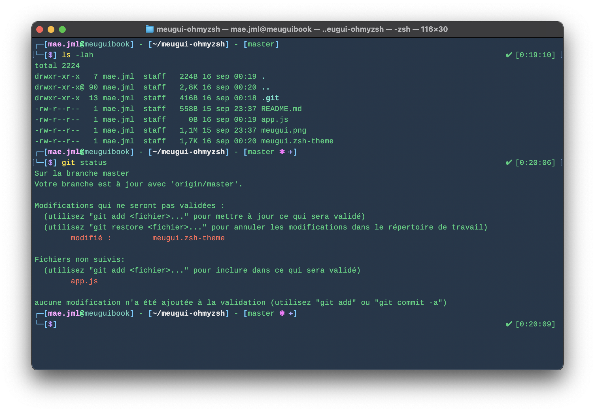
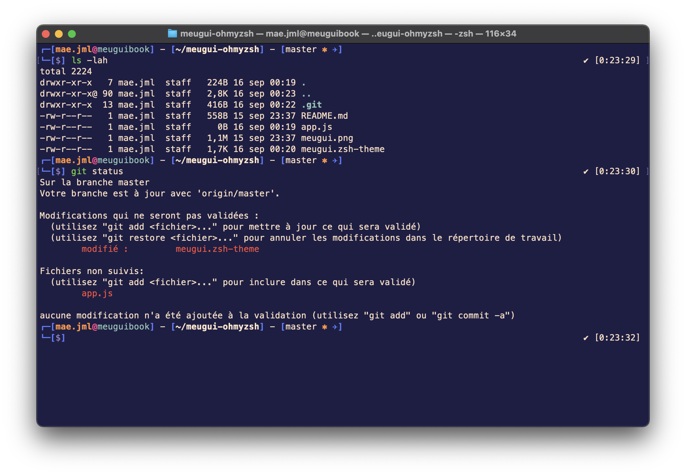

# meugui theme

OhMyZsh theme based on [duellj](https://github.com/ohmyzsh/ohmyzsh/blob/master/themes/duellj.zsh-theme), added git info. 👍




## Installation

Open terminal and run:

```bash
$ mkdir -p $ZSH_CUSTOM/themes && curl https://raw.githubusercontent.com/maejml/meugui-ohmyzsh/master/meugui.zsh-theme -L -o $ZSH_CUSTOM/themes/meugui.zsh-theme
```

Then change the theme in your **.zshrc** file

```bash
$ vim ~/.zshrc
```

```vim
# See https://github.com/ohmyzsh/ohmyzsh/wiki/Themes
ZSH_THEME="meugui"
```

Cheers! 🤓🥳
